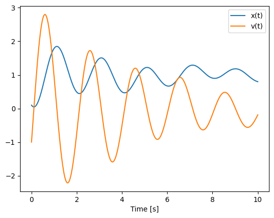

zorios
================

<!-- WARNING: THIS FILE WAS AUTOGENERATED! DO NOT EDIT! -->

This file will become your README and also the index of your
documentation.

## Install

``` sh
pip install zorios
```

## How to use

Fill me in please! Don’t forget code examples:

``` python
import sympy as sm
```

``` python
mass = sm.symbols('m:{}'.format(2))
```

``` python
mass[0]
```

    m0

``` python
from sympy import symbols
import sympy.physics.mechanics as me

mass, stiffness, damping, gravity = symbols('m, k, c, g')

position, speed = me.dynamicsymbols('x v')
positiond = me.dynamicsymbols('x', 1)
force = me.dynamicsymbols('F')

ceiling = me.ReferenceFrame('N')

origin = me.Point('origin')
origin.set_vel(ceiling, 0)

center = origin.locatenew('center', position * ceiling.x)
center.set_vel(ceiling, speed * ceiling.x)

block = me.Particle('block', center, mass)

kinematic_equations = [speed - positiond]

force_magnitude = mass * gravity - stiffness * position - damping * speed + force
forces = [(center, force_magnitude * ceiling.x)]

particles = [block]

kane = me.KanesMethod(ceiling, q_ind=[position], u_ind=[speed],
                      kd_eqs=kinematic_equations)
kane.kanes_equations(particles, loads=forces)
```

    (Matrix([[-c*v(t) + g*m - k*x(t) + F(t)]]), Matrix([[-m*Derivative(v(t), t)]]))

``` python
block
```

    block

``` python
from numpy import array, linspace, sin
from pydy.system import System

sys = System(kane,
             constants={mass: 1.0, stiffness: 10.0,
                        damping: 0.4, gravity: 9.8},
             specifieds={force: lambda x, t: sin(t)},
             initial_conditions={position: 0.1, speed: -1.0},
             times=linspace(0.0, 10.0, 1000))
```

``` python
y = sys.integrate()
```

``` python
import matplotlib.pyplot as plt

plt.plot(sys.times, y)
plt.legend((str(position), str(speed)))
plt.xlabel('Time [s]')
plt.show()
```


